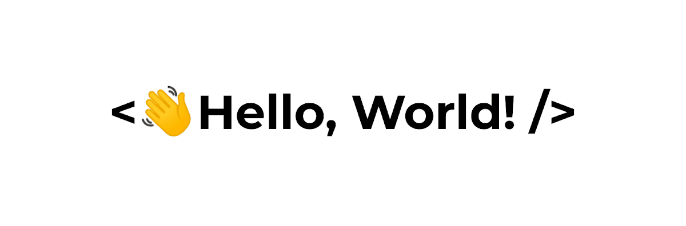

### 
I'm Camilo, Software systems engineering student at Icesi University 👨‍💻 I ♥️ coding 🚀

- 🔭 Open to imagine the future :)

- 🌱 Learning C++, Golang and distributed applications development.

- ⚡ Interesting fact: I love the underground techno music 👽

 

## My Skill Set  
<table><tr><td valign="top" width="33%">

### Frontend  

  
  
  
  
  
  
  
  

</td><td valign="top" width="33%">

### Backend  

  
  
  
  
  
  
  
  
  
  
  
  
  

</td><td valign="top" width="33%">

### DevOps  

  
  
  
  
  
  
  
  
  
  

</td></tr></table>  

   

⠀⠀⠀⠀⠀⠀⠀⠀⠀⠀⠀⠀⠀⠀⠀⠀⠀⠀⠀⠀⠀⠀⠀⠀⠀⠀⠀⠀⠀⠀⠀⠀⠀⠀⠀⠀⠀⠀⠀⠀⠀⠀⠀⠀⠀⠀⠀⠀⠀⠀⠀⠀⠀⠀⠀⠀⠀⠀⠀⠀⠀⠀⠀⠀⠀⠀⠀⠀⠀⠀⠀⠀

## Connect with me

  

 

⠀⠀⠀⠀⠀⠀⠀⠀⠀⠀⠀⠀⠀⠀⠀⠀⠀⠀⠀⠀⠀⠀⠀⠀⠀⠀⠀⠀⠀⠀⠀⠀⠀⠀⠀⠀⠀⠀⠀⠀⠀⠀⠀⠀⠀⠀⠀⠀⠀⠀⠀⠀⠀⠀⠀⠀⠀⠀⠀⠀⠀⠀⠀⠀⠀⠀⠀⠀⠀⠀⠀⠀
## Github Stats  
<table><tr><td valign="top" width="50%">

</td><td valign="top" width="50%">

</td></tr></table>  

 

## My music

 

 

 

---
