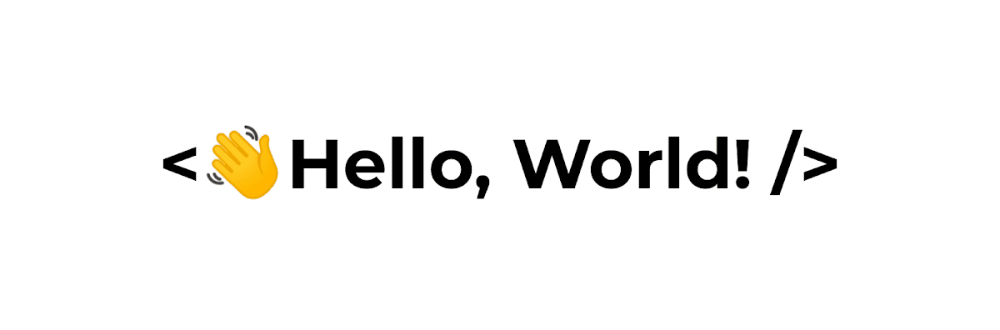

  
  

### 
I'm Camilo Cordoba, Software System Engineering student at ICESI University 👨‍💻 I ♥️ coding  🚀
  
  

- 🔭 I’m currently working on [Icesi Tinder](https://github.com/Dannasofiagarcia/IcesiTinder)  
  

- 🌱 Learning C++, Python and web development.  
  

- ⚡ Interesting fact: I love the underground techno music 👽  
  

   

## My Skill Set  
<table align=center><tr><td valign="top" width="33%">

### Frontend  

  
  
  

</td><td valign="top" width="33%">

### Backend  

  
  
  
  

</td><td valign="top" width="33%">

### DevOps  

  
  
  
  

</td></tr></table>  

   

⠀⠀⠀⠀⠀⠀⠀⠀⠀⠀⠀⠀⠀⠀⠀⠀⠀⠀⠀⠀⠀⠀⠀⠀⠀⠀⠀⠀⠀⠀⠀⠀⠀⠀⠀⠀⠀⠀⠀⠀⠀⠀⠀⠀⠀⠀⠀⠀⠀⠀⠀⠀⠀⠀⠀⠀⠀⠀⠀⠀⠀⠀⠀⠀⠀⠀⠀⠀⠀⠀⠀⠀

## Connect with me  

  

  
  

   

⠀⠀⠀⠀⠀⠀⠀⠀⠀⠀⠀⠀⠀⠀⠀⠀⠀⠀⠀⠀⠀⠀⠀⠀⠀⠀⠀⠀⠀⠀⠀⠀⠀⠀⠀⠀⠀⠀⠀⠀⠀⠀⠀⠀⠀⠀⠀⠀⠀⠀⠀⠀⠀⠀⠀⠀⠀⠀⠀⠀⠀⠀⠀⠀⠀⠀⠀⠀⠀⠀⠀⠀

## Github Stats  
⠀⠀⠀⠀⠀⠀⠀⠀⠀⠀⠀⠀⠀⠀⠀⠀⠀⠀⠀⠀⠀⠀⠀⠀⠀⠀⠀⠀⠀⠀⠀⠀⠀⠀⠀⠀⠀⠀⠀⠀⠀⠀⠀⠀⠀⠀⠀⠀⠀⠀⠀⠀⠀⠀⠀⠀⠀⠀⠀⠀⠀⠀⠀⠀⠀⠀⠀⠀⠀⠀⠀⠀

  
<a >
    ⠀⠀⠀⠀⠀⠀⠀⠀⠀⠀⠀⠀⠀⠀⠀⠀⠀⠀⠀⠀⠀⠀⠀⠀⠀⠀⠀⠀⠀⠀⠀⠀⠀⠀⠀⠀⠀⠀⠀⠀⠀⠀⠀⠀⠀⠀⠀⠀⠀⠀⠀⠀⠀⠀⠀⠀⠀⠀⠀⠀⠀⠀⠀⠀⠀⠀⠀⠀⠀⠀⠀⠀

</a>

  

   

##  ‎ ‏‏‎‎ ‏‏‎‎ ‏‏‎‎ ‏‏‎‎ ‏‏‎‎ ‏‏‎‎ ‏‏‎‎ ‏‏‎‎ ‏‏‎‎ ‏‏‎‎ ‏‏‎ 
  

   

## My music

  

   

  
  

   

 

----
